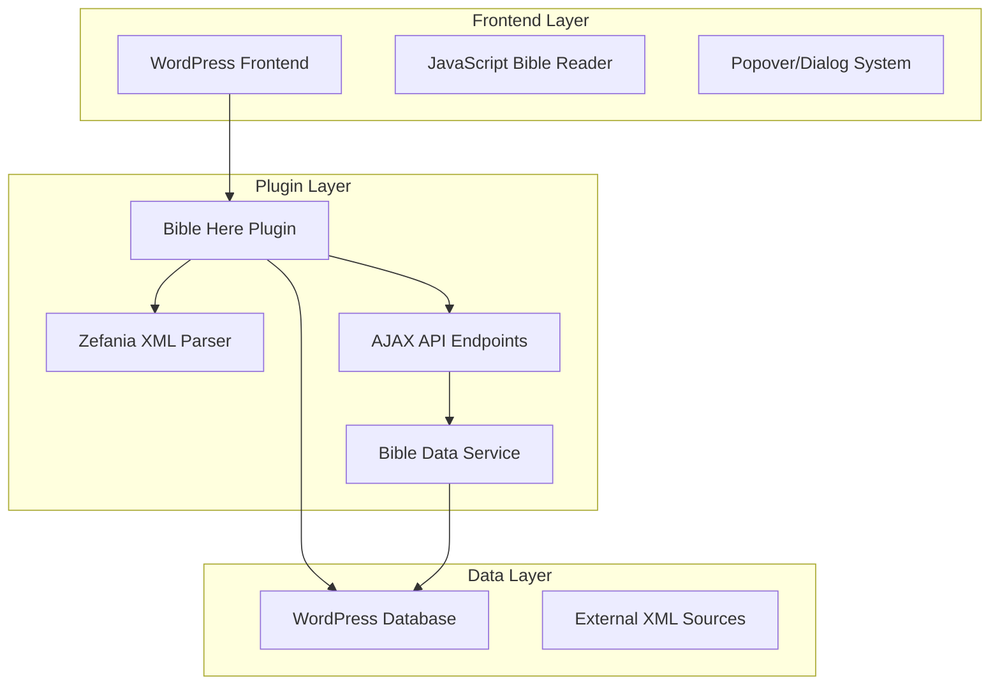
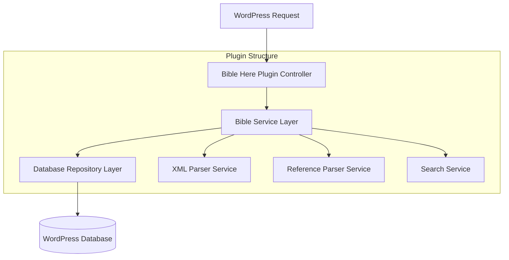
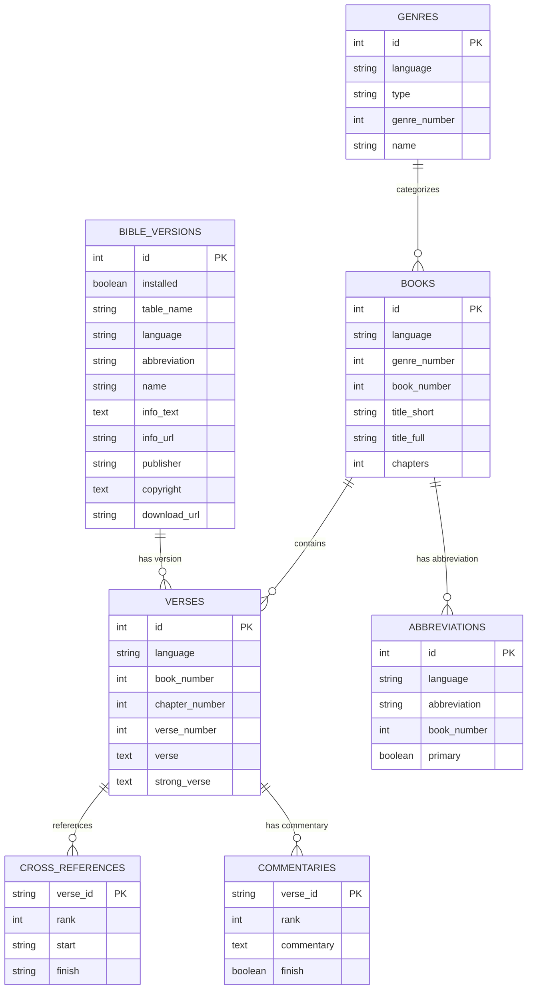

# Bible Here WordPress Plugin 技術架構文檔

## 1. Architecture Design



## 2. Technology Description

* Frontend: JavaScript (ES6+) + WordPress REST API + HTML5 Popover API

* Backend: PHP 7.4+ + WordPress Plugin API + MySQL/MariaDB

* Data Format: Zefania XML + UTF8MB4 Database Tables

* Architecture: WordPress Plugin Boilerplate Structure

## 3. Route Definitions

| Route                               | Purpose              |
| ----------------------------------- | -------------------- |
| /bible-reader                       | 主要聖經閱讀介面，支持版本選擇和章節導航 |
| /bible-search                       | 聖經全文搜尋頁面，提供進階搜尋功能    |
| /wp-admin/admin.php?page=bible-here | 管理員設定頁面，管理聖經版本和插件配置  |

## 4. API Definitions

### 4.1 Core API

**獲取聖經章節內容**

```
GET /wp-json/bible-here/v1/chapter
```

Request:

| Param Name       | Param Type | isRequired | Description                  |
| ---------------- | ---------- | ---------- | ---------------------------- |
| version          | string     | true       | 聖經版本代碼 (如: en\_kjv, zh\_cuv) |
| book             | integer    | true       | 書卷編號 (1-66)                  |
| chapter          | integer    | true       | 章節編號                         |
| compare\_version | string     | false      | 比對版本代碼                       |

Response:

| Param Name | Param Type | Description |
| ---------- | ---------- | ----------- |
| success    | boolean    | API 調用狀態    |
| data       | object     | 章節資料        |
| verses     | array      | 經文陣列        |
| book\_info | object     | 書卷資訊        |

**搜尋聖經經文**

```
POST /wp-json/bible-here/v1/search
```

Request:

| Param Name | Param Type | isRequired | Description    |
| ---------- | ---------- | ---------- | -------------- |
| query      | string     | true       | 搜尋關鍵字          |
| version    | string     | true       | 搜尋的聖經版本        |
| books      | array      | false      | 限制搜尋的書卷範圍      |
| limit      | integer    | false      | 結果數量限制 (預設 50) |

**匯入聖經版本**

```
POST /wp-json/bible-here/v1/import
```

Request:

| Param Name    | Param Type | isRequired | Description        |
| ------------- | ---------- | ---------- | ------------------ |
| xml\_url      | string     | true       | Zefania XML 檔案 URL |
| version\_code | string     | true       | 版本代碼               |
| language      | string     | true       | 語言代碼               |

**獲取經文引用資訊**

```
GET /wp-json/bible-here/v1/reference
```

Request:

| Param Name | Param Type | isRequired | Description            |
| ---------- | ---------- | ---------- | ---------------------- |
| reference  | string     | true       | 經文引用 (如: Gen1:1, 創1:1) |
| version    | string     | false      | 指定版本 (預設使用設定版本)        |

Example Request:

```json
{
  "version": "en_kjv",
  "book": 1,
  "chapter": 1,
  "compare_version": "zh_cuv"
}
```

Example Response:

```json
{
  "success": true,
  "data": {
    "book_info": {
      "name": "Genesis",
      "name_zh": "創世記"
    },
    "verses": [
      {
        "verse_number": 1,
        "text": "In the beginning God created the heaven and the earth.",
        "compare_text": "起初，神創造天地。"
      }
    ]
  }
}
```

## 5. Server Architecture Diagram



## 6. Data Model

### 6.1 Data Model Definition



### 6.2 Data Definition Language

**書卷資料表 (wp\_bible\_books)**

```sql
-- 創建書卷表
CREATE TABLE wp_bible_books (
    id INT AUTO_INCREMENT PRIMARY KEY,
    language VARCHAR(10) NOT NULL,
    genre_number TINYINT NOT NULL,
    book_number TINYINT NOT NULL,
    title_short VARCHAR(20) NOT NULL,
    title_full VARCHAR(100) NOT NULL,
    chapters TINYINT NOT NULL,
    created_at TIMESTAMP DEFAULT CURRENT_TIMESTAMP,
    UNIQUE KEY unique_book (language, book_number),
    INDEX idx_language (language),
    INDEX idx_book_number (book_number)
) ENGINE=InnoDB DEFAULT CHARSET=utf8mb4 COLLATE=utf8mb4_unicode_ci;

-- 初始化資料 (部分範例)
INSERT INTO wp_bible_books (language, genre_number, book_number, title_short, title_full, chapters) VALUES
('en', 1, 1, 'Gen', 'Genesis', 50),
('en', 1, 2, 'Exo', 'Exodus', 40),
('zh', 1, 1, '創', '創世記', 50),
('zh', 1, 2, '出', '出埃及記', 40);
```

**聖經版本表 (wp\_bible\_versions)**

```sql
CREATE TABLE wp_bible_versions (
    id INT AUTO_INCREMENT PRIMARY KEY,
    installed BOOLEAN DEFAULT FALSE,
    table_name VARCHAR(50) NOT NULL,
    language VARCHAR(10) NOT NULL,
    abbreviation VARCHAR(20) NOT NULL,
    name VARCHAR(100) NOT NULL,
    info_text TEXT,
    info_url VARCHAR(255),
    publisher VARCHAR(100),
    copyright TEXT,
    download_url VARCHAR(255),
    created_at TIMESTAMP DEFAULT CURRENT_TIMESTAMP,
    UNIQUE KEY unique_version (language, abbreviation),
    INDEX idx_installed (installed),
    INDEX idx_language (language)
) ENGINE=InnoDB DEFAULT CHARSET=utf8mb4 COLLATE=utf8mb4_unicode_ci;

-- 預設 KJV 版本
INSERT INTO wp_bible_versions (installed, table_name, language, abbreviation, name, publisher, copyright) VALUES
(TRUE, 'wp_bible_en_kjv', 'en', 'KJV', 'King James Version', 'Public Domain', 'Public Domain');
```

**經文表範例 (wp\_bible\_en\_kjv)**

```sql
CREATE TABLE wp_bible_en_kjv (
    id BIGINT AUTO_INCREMENT PRIMARY KEY,
    book_number TINYINT NOT NULL,
    chapter_number TINYINT NOT NULL,
    verse_number TINYINT NOT NULL,
    verse TEXT NOT NULL,
    strong_verse TEXT,
    created_at TIMESTAMP DEFAULT CURRENT_TIMESTAMP,
    UNIQUE KEY unique_verse (book_number, chapter_number, verse_number),
    INDEX idx_chapter (book_number, chapter_number),
    FULLTEXT KEY ft_verse (verse)
) ENGINE=InnoDB DEFAULT CHARSET=utf8mb4 COLLATE=utf8mb4_unicode_ci;

-- 設定 MySQL 全文搜尋 (MySQL 5.7.6+)
SET GLOBAL ngram_token_size=2;
```

**縮寫表 (wp\_bible\_abbreviations)**

```sql
CREATE TABLE wp_bible_abbreviations (
    id INT AUTO_INCREMENT PRIMARY KEY,
    language VARCHAR(10) NOT NULL,
    abbreviation VARCHAR(20) NOT NULL,
    book_number TINYINT NOT NULL,
    is_primary BOOLEAN DEFAULT FALSE,
    created_at TIMESTAMP DEFAULT CURRENT_TIMESTAMP,
    INDEX idx_language (language),
    INDEX idx_abbreviation (abbreviation),
    INDEX idx_book_number (book_number)
) ENGINE=InnoDB DEFAULT CHARSET=utf8mb4 COLLATE=utf8mb4_unicode_ci;

-- 初始化縮寫資料
INSERT INTO wp_bible_abbreviations (language, abbreviation, book_number, is_primary) VALUES
('en', 'Gen', 1, TRUE),
('en', 'Genesis', 1, FALSE),
('zh', '創', 1, TRUE),
('zh', '創世記', 1, FALSE);
```

**串珠表 (wp\_bible\_cross\_references)**

```sql
CREATE TABLE wp_bible_cross_references (
    verse_id VARCHAR(20) NOT NULL,
    rank TINYINT NOT NULL,
    start_verse_id VARCHAR(20) NOT NULL,
    end_verse_id VARCHAR(20),
    created_at TIMESTAMP DEFAULT CURRENT_TIMESTAMP,
    PRIMARY KEY (verse_id, rank),
    INDEX idx_start_verse (start_verse_id)
) ENGINE=InnoDB DEFAULT CHARSET=utf8mb4 COLLATE=utf8mb4_unicode_ci;
```

## 7. Plugin File Structure

基於 WordPress Plugin Boilerplate 的檔案結構：

```
bible-here/
├── admin/
│   ├── class-bible-here-admin.php
│   ├── css/
│   ├── js/
│   └── partials/
├── includes/
│   ├── class-bible-here.php
│   ├── class-bible-here-loader.php
│   ├── class-bible-here-activator.php
│   └── class-bible-here-deactivator.php
├── public/
│   ├── class-bible-here-public.php
│   ├── css/
│   ├── js/
│   └── partials/
├── languages/
├── bible-here.php
├── README.md
└── uninstall.php
```

