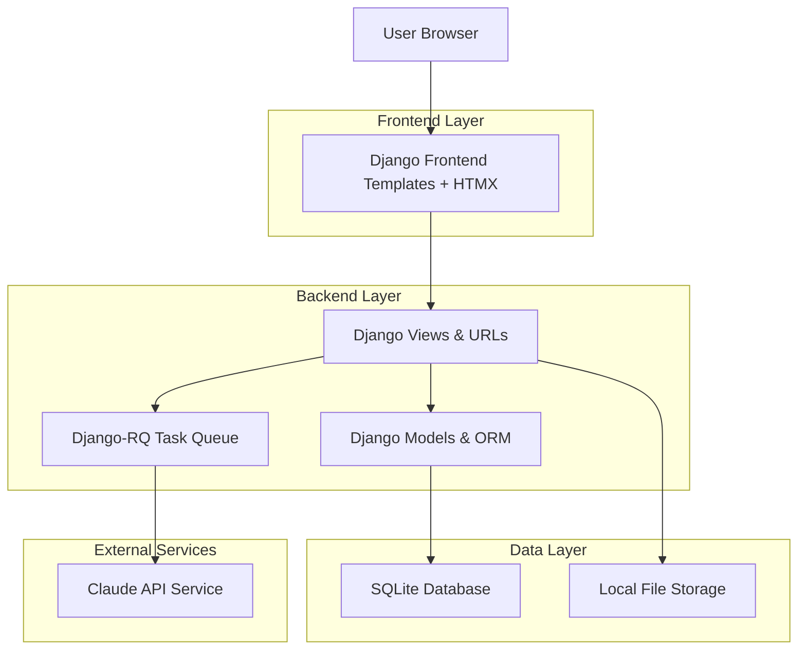
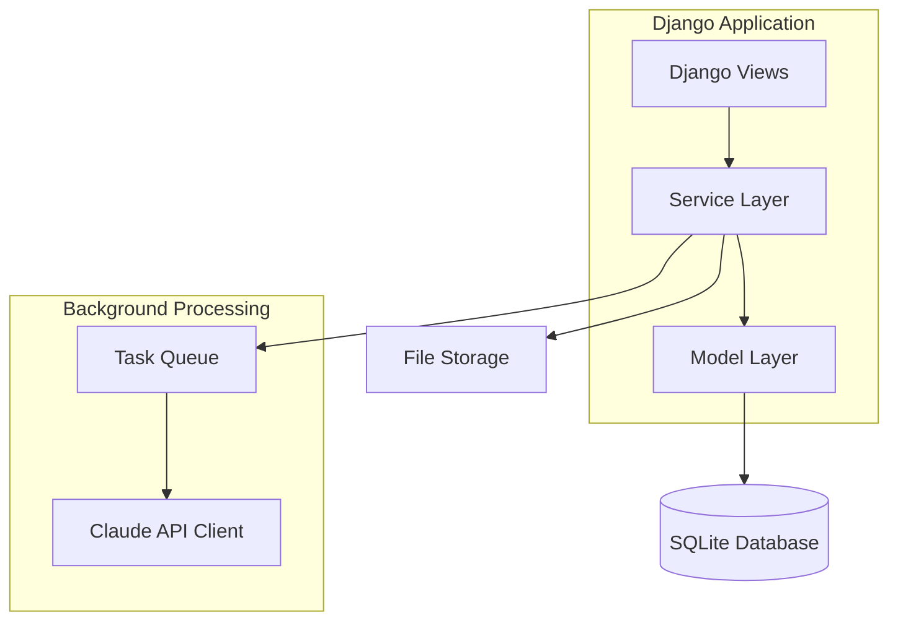
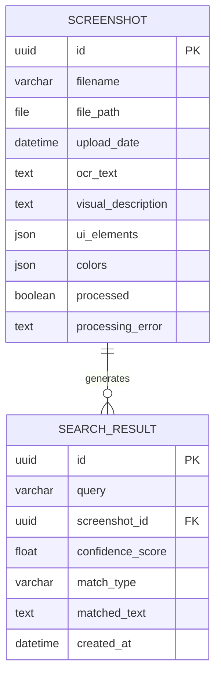

# Visual Memory Search App - Technical Architecture Document

## 1. Architecture Design



## 2. Technology Description

* Frontend: Django Templates + HTMX + Tailwind CSS CDN + Dropzone.js

* Backend: Django 5.0 + Django-RQ + Anthropic Claude API

* Database: SQLite (for rapid development)

* File Storage: Local filesystem (/media/screenshots/)

* Task Queue: Django-RQ with Redis

## 3. Route Definitions

| Route             | Purpose                                            |
| ----------------- | -------------------------------------------------- |
| /                 | Home page with upload interface and search bar     |
| /upload/          | Bulk screenshot upload page with progress tracking |
| /search/          | Search results page with top 5 matches             |
| /screenshot/<id>/ | Individual screenshot detail view                  |
| /api/upload/      | AJAX endpoint for file uploads                     |
| /api/search/      | AJAX endpoint for search queries                   |
| /api/status/<id>/ | Processing status check endpoint                   |

## 4. API Definitions

### 4.1 Core API

**File Upload**

```
POST /api/upload/
```

Request (multipart/form-data):

| Param Name | Param Type | isRequired | Description                                |
| ---------- | ---------- | ---------- | ------------------------------------------ |
| files      | File\[]    | true       | Array of screenshot files (PNG, JPG, JPEG) |

Response:

| Param Name      | Param Type | Description                    |
| --------------- | ---------- | ------------------------------ |
| success         | boolean    | Upload status                  |
| screenshot\_ids | array      | List of created screenshot IDs |
| message         | string     | Status message                 |

Example Response:

```json
{
  "success": true,
  "screenshot_ids": [1, 2, 3],
  "message": "3 screenshots uploaded successfully"
}
```

**Search Screenshots**

```
POST /api/search/
```

Request:

| Param Name | Param Type | isRequired | Description                    |
| ---------- | ---------- | ---------- | ------------------------------ |
| query      | string     | true       | Natural language search query  |
| limit      | integer    | false      | Number of results (default: 5) |

Response:

| Param Name   | Param Type | Description                    |
| ------------ | ---------- | ------------------------------ |
| results      | array      | Array of search result objects |
| total\_count | integer    | Total matching screenshots     |

Example Response:

```json
{
  "results": [
    {
      "id": 1,
      "filename": "login_screen.png",
      "thumbnail_url": "/media/screenshots/login_screen.png",
      "confidence_score": 0.85,
      "match_type": "text",
      "matched_text": "login button",
      "upload_date": "2024-01-15T10:30:00Z"
    }
  ],
  "total_count": 12
}
```

**Processing Status**

```
GET /api/status/<screenshot_id>/
```

Response:

| Param Name | Param Type | Description                        |
| ---------- | ---------- | ---------------------------------- |
| processed  | boolean    | Processing completion status       |
| error      | string     | Error message if processing failed |
| progress   | string     | Current processing stage           |

## 5. Server Architecture Diagram



## 6. Data Model

### 6.1 Data Model Definition



### 6.2 Data Definition Language

**Screenshot Table**

```sql
-- Create screenshot table
CREATE TABLE screenshots_screenshot (
    id INTEGER PRIMARY KEY AUTOINCREMENT,
    filename VARCHAR(255) NOT NULL,
    file_path VARCHAR(100) NOT NULL,
    upload_date DATETIME NOT NULL,
    ocr_text TEXT,
    visual_description TEXT,
    ui_elements JSON DEFAULT '[]',
    colors JSON DEFAULT '[]',
    processed BOOLEAN DEFAULT FALSE,
    processing_error TEXT
);

-- Create indexes
CREATE INDEX idx_screenshot_processed ON screenshots_screenshot(processed);
CREATE INDEX idx_screenshot_upload_date ON screenshots_screenshot(upload_date DESC);
CREATE INDEX idx_screenshot_filename ON screenshots_screenshot(filename);
```

**SearchResult Table**

```sql
-- Create search result table
CREATE TABLE screenshots_searchresult (
    id INTEGER PRIMARY KEY AUTOINCREMENT,
    query VARCHAR(500) NOT NULL,
    screenshot_id INTEGER NOT NULL,
    confidence_score REAL NOT NULL,
    match_type VARCHAR(20) NOT NULL,
    matched_text TEXT,
    created_at DATETIME NOT NULL,
    FOREIGN KEY (screenshot_id) REFERENCES screenshots_screenshot(id)
);

-- Create indexes
CREATE INDEX idx_searchresult_query ON screenshots_searchresult(query);
CREATE INDEX idx_searchresult_confidence ON screenshots_searchresult(confidence_score DESC);
CREATE INDEX idx_searchresult_created_at ON screenshots_searchresult(created_at DESC);
```

**Initial Data**

```sql
-- No initial data required for this application
-- Screenshots and search results are user-generated content
```

