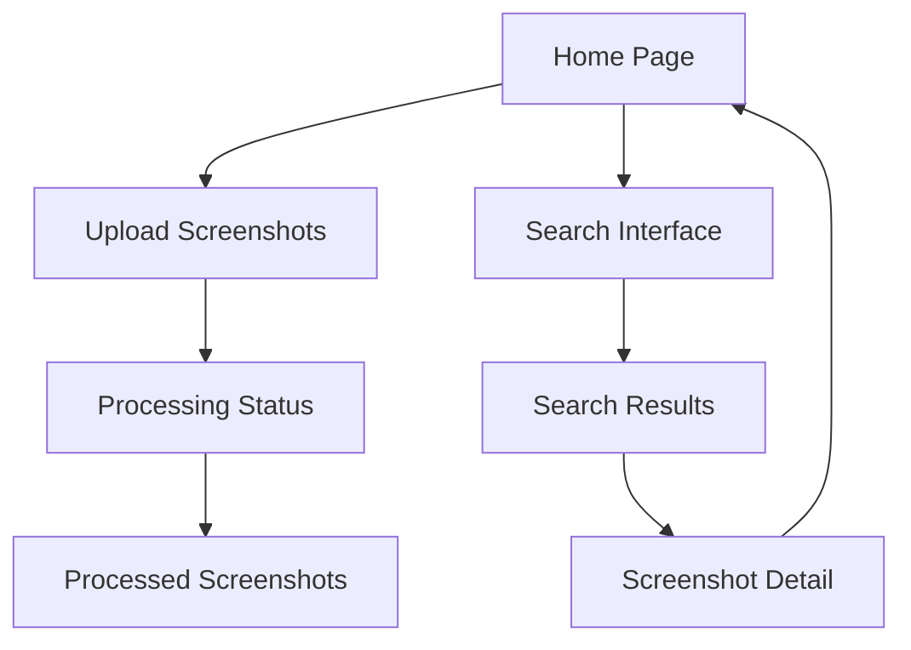

# Visual Memory Search App - Product Requirements Document

## 1. Product Overview
A Django-based web application that enables users to search through screenshot collections using natural language queries for both text content and visual elements. The app automatically processes uploaded screenshots using Claude API for OCR text extraction and visual element description, then provides intelligent search capabilities with confidence scoring.

- **Core Problem**: Users need to quickly find specific screenshots from large collections based on text content or visual elements without manual tagging.
- **Target Users**: Developers, designers, QA testers, and professionals who work with large screenshot collections.
- **Market Value**: Streamlines screenshot management and retrieval, saving significant time in documentation and debugging workflows.

## 2. Core Features

### 2.1 User Roles
| Role | Registration Method | Core Permissions |
|------|---------------------|------------------|
| User | Direct access (no registration) | Can upload screenshots, search collections, view results |

### 2.2 Feature Module
Our Visual Memory Search App consists of the following main pages:
1. **Home page**: Upload interface, search bar, recent uploads display.
2. **Upload page**: Bulk screenshot upload via folder selection, processing status.
3. **Search results page**: Top 5 results display, match highlighting, confidence scores.
4. **Screenshot detail page**: Full image view, extracted text, visual descriptions.

### 2.3 Page Details
| Page Name | Module Name | Feature description |
|-----------|-------------|---------------------|
| Home page | Upload Interface | Drag-and-drop file upload using Dropzone.js, folder selection support, upload progress tracking |
| Home page | Search Bar | Natural language query input, real-time search suggestions, search history |
| Home page | Recent Uploads | Display recently uploaded screenshots with processing status indicators |
| Upload page | Bulk Upload | Multiple file selection, folder upload support, file type validation (PNG, JPG, JPEG) |
| Upload page | Processing Status | Real-time progress updates, error handling display, retry failed uploads |
| Search results page | Results Display | Top 5 matching screenshots with thumbnails, confidence scores, match type indicators |
| Search results page | Match Highlighting | Highlight matched text content, visual element tags, color indicators |
| Screenshot detail page | Image Viewer | Full-size image display, zoom functionality, metadata information |
| Screenshot detail page | Extracted Content | Display OCR text, visual descriptions, UI elements, color palette |

## 3. Core Process

### Upload and Processing Flow
1. User selects multiple screenshots or entire folder
2. Files are uploaded to local storage (/media/screenshots/)
3. Screenshot records created in database with pending status
4. Background tasks process each screenshot via Claude API
5. OCR text extraction and visual description generation
6. Database updated with processed content and status

### Search and Retrieval Flow
1. User enters natural language search query
2. System searches OCR text, visual descriptions, UI elements, and colors
3. Confidence scores calculated using weighted algorithm
4. Top 5 results ranked and returned with highlighting
5. User can view detailed screenshot information

## 4. User Interface Design

### 4.1 Design Style
- **Primary Colors**: Blue (#3B82F6), Green (#10B981) for success states
- **Secondary Colors**: Gray (#6B7280) for text, Red (#EF4444) for errors
- **Button Style**: Rounded corners (8px), subtle shadows, hover animations
- **Font**: Inter or system fonts, 14px base size, 16px for headings
- **Layout Style**: Clean card-based design, responsive grid layout, top navigation
- **Icons**: Heroicons or similar minimal icon set, consistent sizing

### 4.2 Page Design Overview
| Page Name | Module Name | UI Elements |
|-----------|-------------|-------------|
| Home page | Upload Interface | Large dropzone area with dashed border, upload icon, progress bars, file preview cards |
| Home page | Search Bar | Prominent search input with magnifying glass icon, autocomplete dropdown, recent searches |
| Search results page | Results Grid | Card layout with image thumbnails, confidence badges, match type indicators, hover effects |
| Screenshot detail page | Image Viewer | Centered image with zoom controls, metadata sidebar, extracted content panels |

### 4.3 Responsiveness
Desktop-first design with mobile-adaptive breakpoints. Touch interaction optimization for mobile devices including swipe gestures for image navigation and touch-friendly button sizing.
